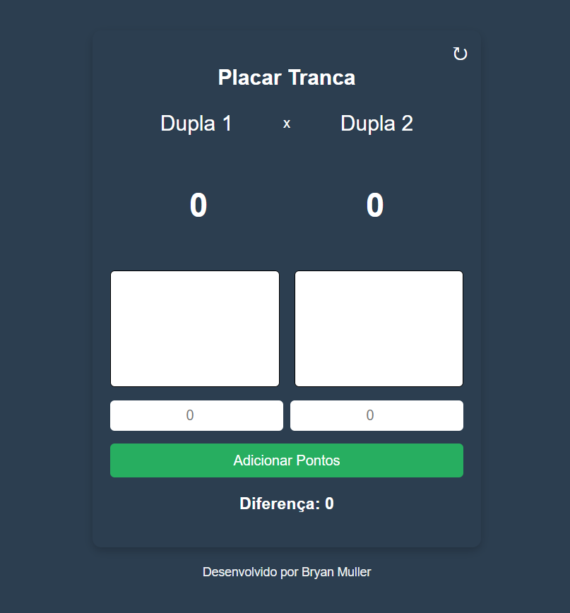

# 🃏 Placar Tranca

Uma aplicação web simples para controlar a pontuação do jogo de cartas Tranca em partidas entre duas duplas.

## 🚀 Funcionalidades

- Interface intuitiva e responsiva
- Contador de pontos para duas duplas (Dupla 1 e Dupla 2)
- Cálculo automático da diferença de pontos
- Botão para **adicionar pontos**
- Botão de **resetar** no canto superior direito com ícone
- Desenvolvido com HTML, CSS e JavaScript puro

## 📷 Interface

## 🔧 Como usar

1. Clone o repositório ou baixe os arquivos.
2. Abra o arquivo `index.html` em um navegador.
3. Insira os pontos de cada dupla nos campos apropriados.
4. Clique em **Adicionar Pontos**.
5. Para zerar tudo, clique no botão 🔄 no canto superior direito.

## 🧠 Lógica de funcionamento

- Os valores inseridos são somados ao placar atual.
- A diferença entre os pontos das duplas é exibida dinamicamente.
- O botão de reset redefine todos os valores para 0.

## 📁 Estrutura do projeto

placar-tranca/ 
    ├── index.html # Estrutura principal da interface 
    ├── style.css # Estilização customizada 
    ├── script.js # Lógica para funcionamento do placar 
    └── image.png # Imagem demonstrativa da interface 

## 📄 Licença

Este projeto é livre para uso pessoal. Sinta-se à vontade para modificar e compartilhar.

## 👨‍💻 Desenvolvido por

**Bryan Muller**

---

Feito com ❤️ para deixar sua partida de Tranca mais prática e divertida.